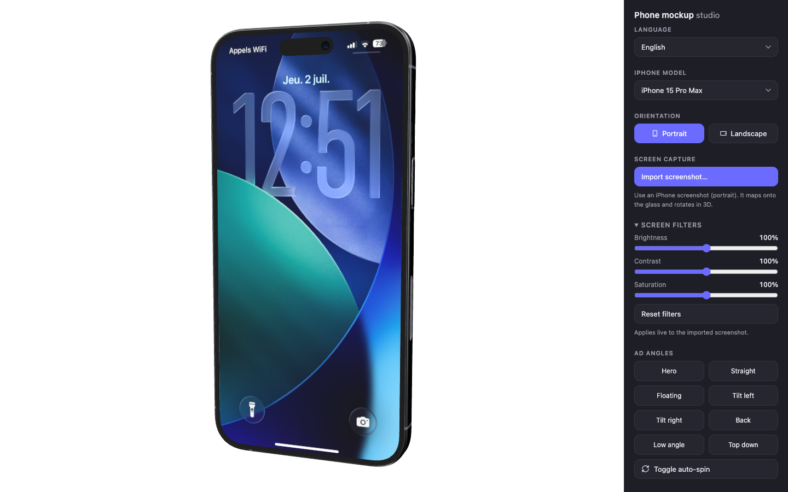
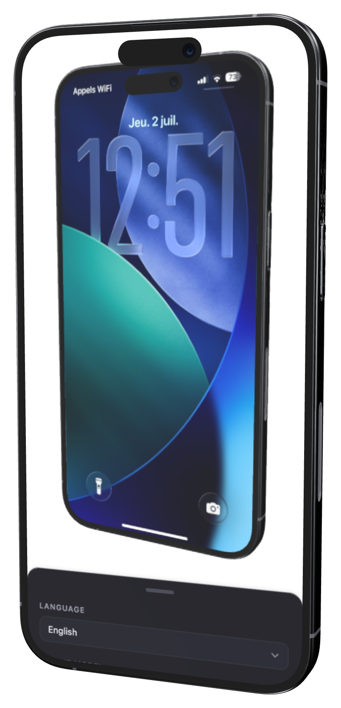
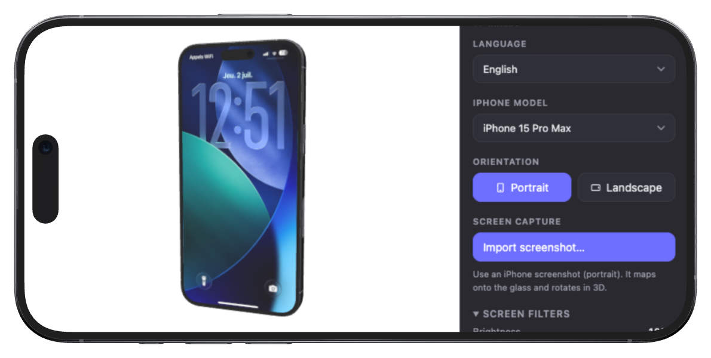

<p align="center">
  
</p>

<h1 align="center">Phone Mockup Studio</h1>

<p align="center">Drop a screenshot onto a photorealistic 3D iPhone, rotate it to any angle, and export a transparent PNG — right in your browser. No signup, no watermark, no build step.</p>

<p align="center"><strong>▶ Live app: <a href="https://quentin-pla.github.io/phone-mockup-studio/">quentin-pla.github.io/phone-mockup-studio</a></strong></p>

<p align="center">
  
  
</p>

<p align="center"><sub>PNGs the app itself exported — mobile screenshots rendered onto an iPhone 15 Pro Max.</sub></p>

## Features

- **Import a screenshot** — it maps straight onto the phone's screen, edge to edge (landscape shots are auto-rotated to fit).
- **Pick a model** — iPhone 15 Pro Max, 17 Pro Max, or 17 Pro.
- **Rotate freely** in 3D, or snap to one-click ad-angle presets (front, back, hero angles).
- **Live screen filters** — brightness, contrast, saturation, applied in real time.
- **Export a transparent PNG** ready for landing pages, App Store shots, or ads.
- **Save to Photos on iOS** via the native share sheet.
- **Multi-language UI** — auto-detected from your browser (English, French, Spanish, German, Italian, Portuguese, Japanese, Chinese), switchable anytime.
- **Works offline** once loaded — pure client-side Three.js.

## Built for content creators

Making a marketing page, a Canva design, or a Figma mockup for your app? A flat screenshot never looks as good as a screenshot *in a phone*. Phone Mockup Studio exports high-resolution, transparent PNGs you can drop straight into any design tool:

- **Canva & Figma ready** — transparent background means it drops onto any layout, color, or gradient with zero editing.
- **High-res output**, sized to look sharp on retina displays and large marketing banners alike.
- **No design skills needed** — pick an ad-angle preset and export; the lighting, reflections, and framing are already done for you.
- **Free and unlimited** — no per-export watermark, no paid tiers, no account.

## Usage

Open the [live app](https://quentin-pla.github.io/phone-mockup-studio/), choose a model, import your screenshot, frame the shot, and hit export.

### Run locally

Because the app fetches `.glb` models over HTTP, it needs a local server (opening the file directly with `file://` won't load the models):

```bash
git clone https://github.com/quentin-pla/phone-mockup-studio.git
cd phone-mockup-studio
python3 -m http.server 8777
# open http://localhost:8777
```

## Built with

- [Three.js](https://threejs.org/) — WebGL rendering, `GLTFLoader`, `OrbitControls`, image-based lighting.

## Credits

The 3D iPhone models are third-party assets under [CC BY 4.0](https://creativecommons.org/licenses/by/4.0/), sourced from Sketchfab. Full attribution in [CREDITS.md](CREDITS.md).

## License

Application code: [MIT](LICENSE) © Quentin PLA.
The bundled 3D models keep their own CC BY 4.0 licenses — see [CREDITS.md](CREDITS.md).

---

*Not affiliated with or endorsed by Apple Inc. "iPhone" is a trademark of Apple Inc., used here only to describe the device models depicted.*
